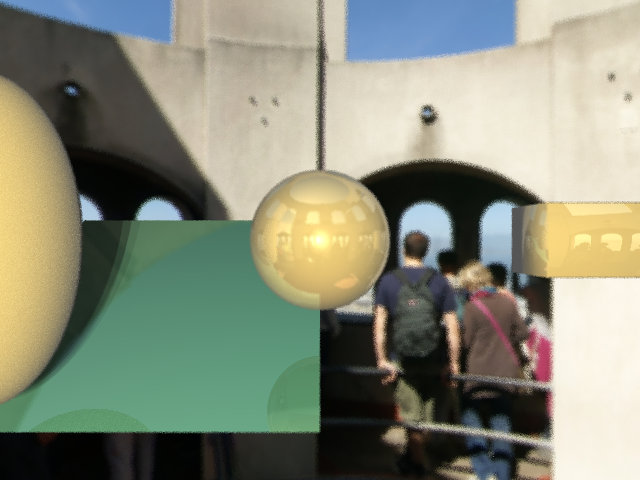
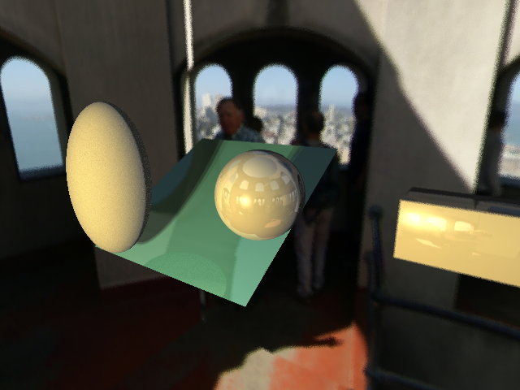
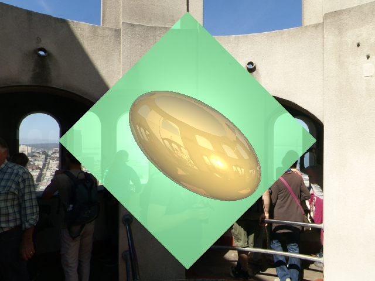
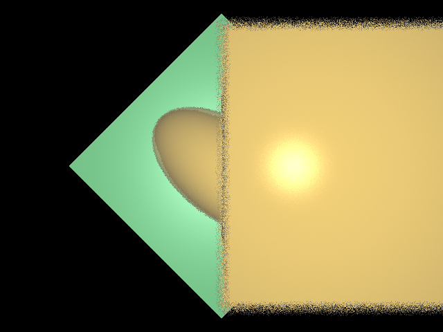

# Raytracing
## How to run
---
```
cd partB
make
./raytracer [width] [height] [options]
```
options are as follows:
[(leave blank): full effect](#final)
0: secondary reflection
[1: hardshadow](#hardshadow)
[2: environment mapping](#cubemap)
[3: anti-aliasing](#anti-aliasing)
[4: softshadow](#softshadow)
[5: glossy reflection](#glossy-reflection)
[6: depth of field](#depth-of-field)
## Result
### Final


### hardshadow
calculate rays emits from the surface back to source and darker those that have crossed over objects


### cubemap
convert texture xyz coordinates to scene uv coordinates


### anti-aliasing
16x supersampling


### softshadow
add multiple different light sources to create multipule shadows


### glossy-reflection
while calculating reflection ray, create some random refelction to make it glossy


### depth-of-field
By casting multiple rays to every pixel, with randomize eye position, adjustable focal distance and aperture. Set the focal distance close to the jade plane, everything else is a bit out of focus, depends on the distance.


